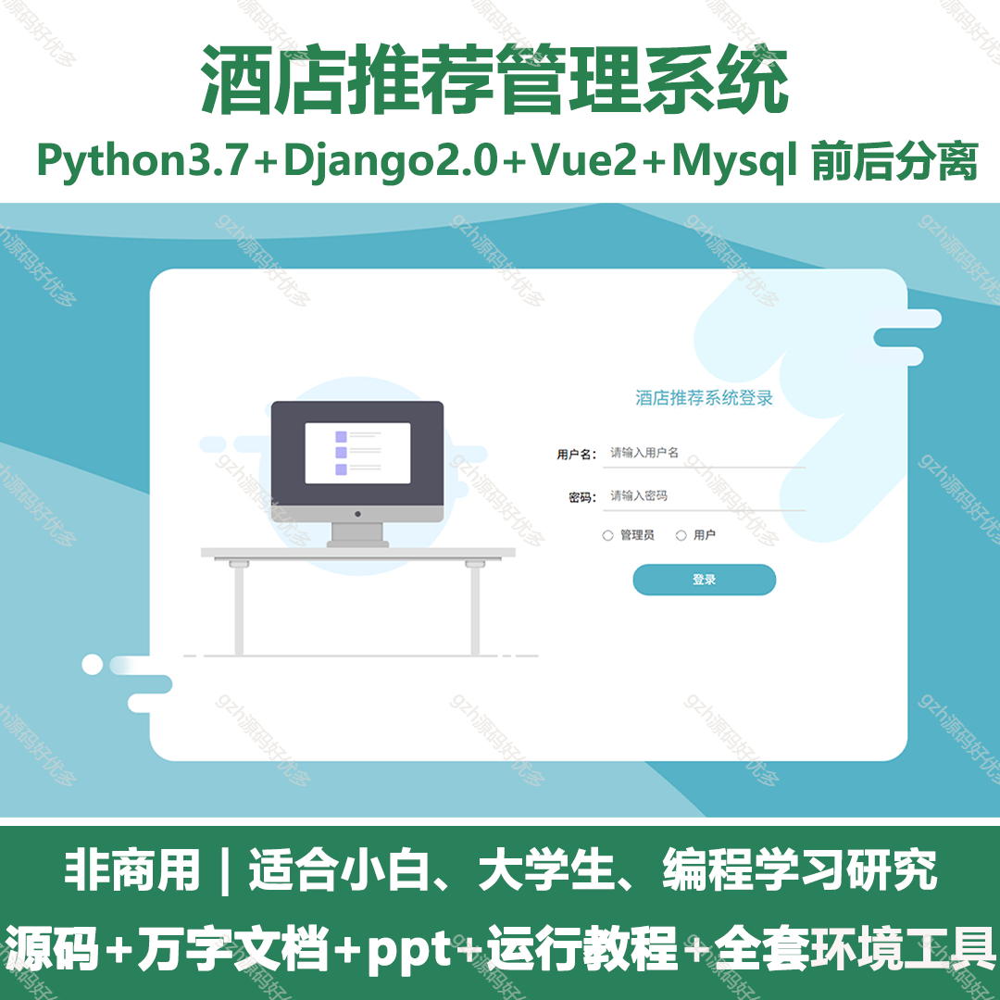
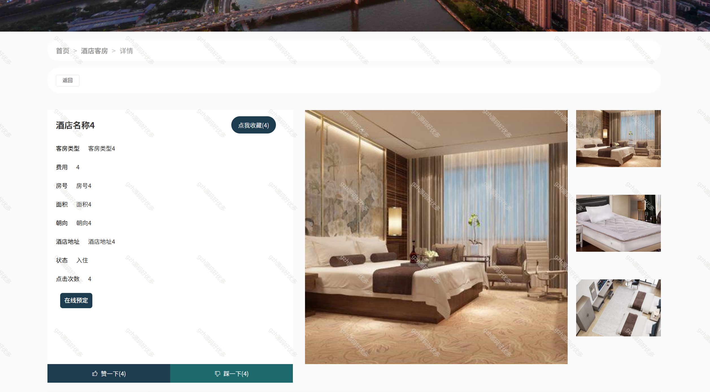
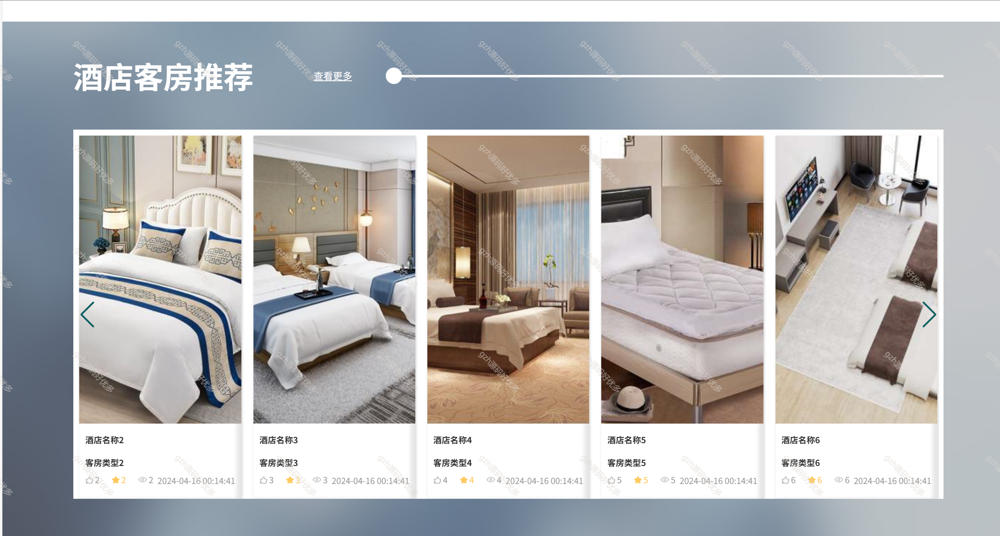
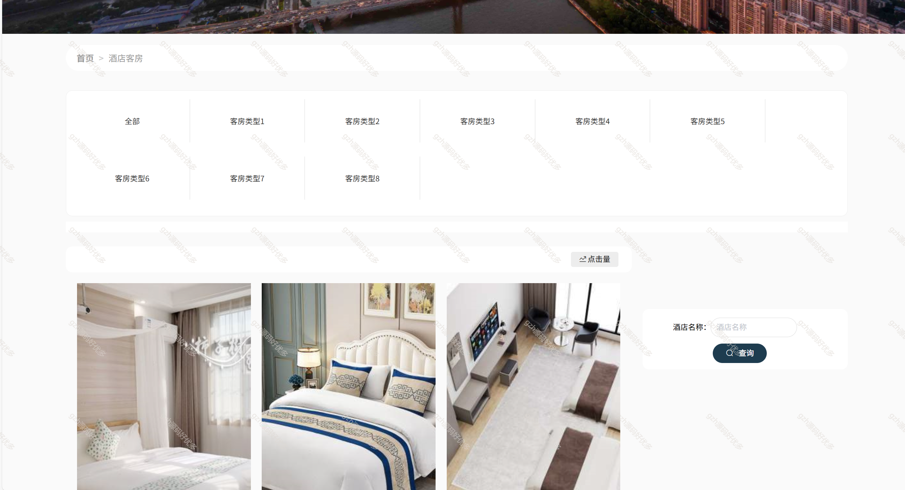
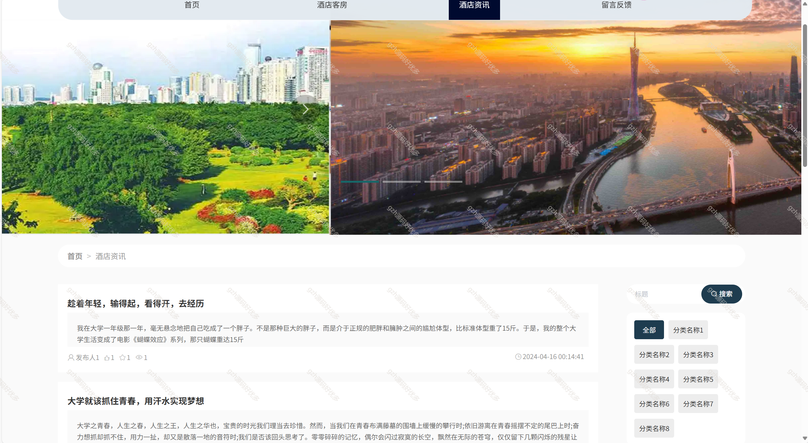
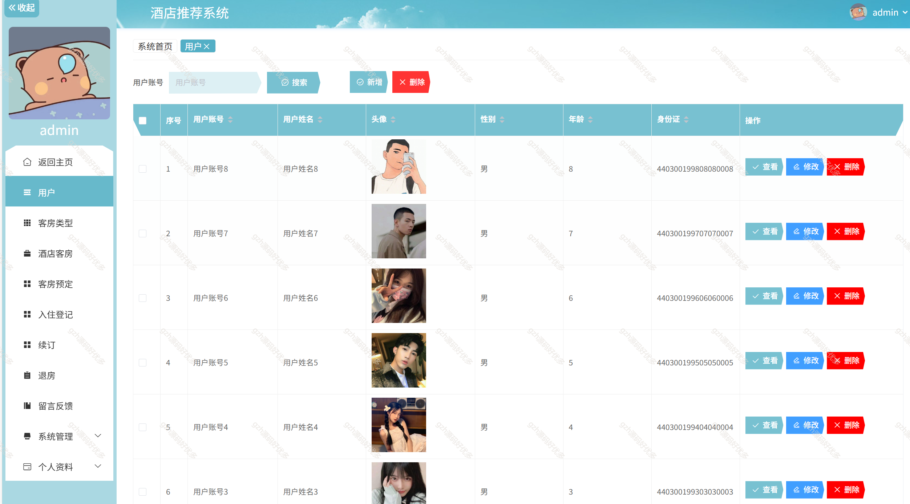
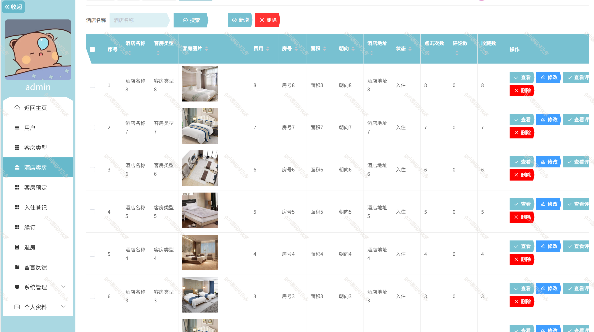
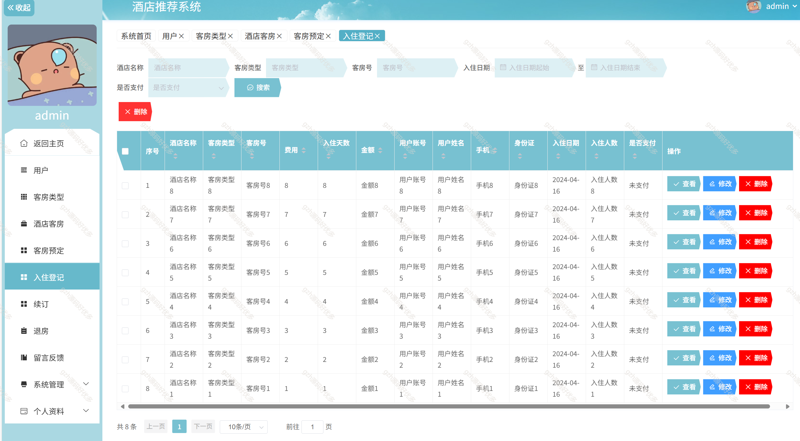
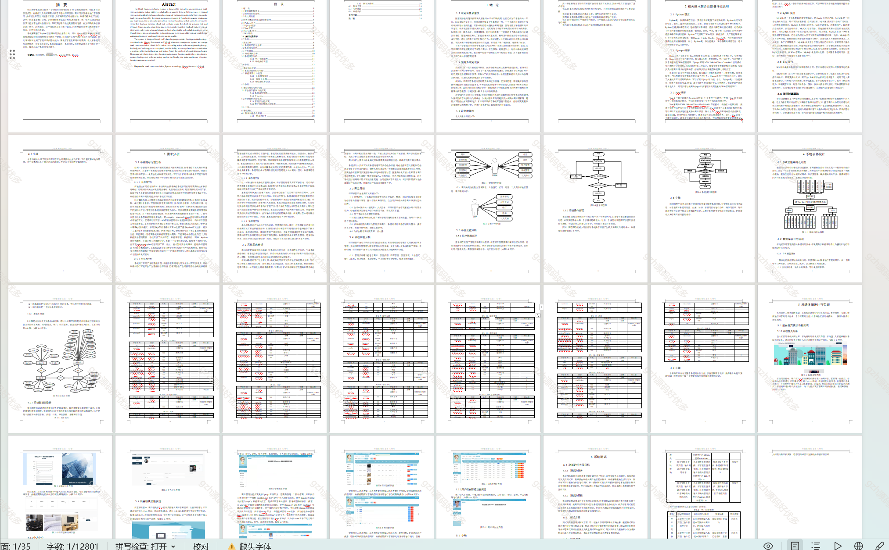

# python048
python048基于Python+Django的酒店推荐系统
 
## 查看主页获取源码

### 一、关键词
酒店推荐系统,酒店系统

### 二、作品包含
源码+数据库+万字文档+PPT+全套环境和工具资源+部署教程

### 三、项目技术
前端技术：Vue2.0、Element-ui
后端技术：Python3.7、Django2.0

### 四、运行环境（以下版本亲测，其他版本未知，请自测）
开发工具：PyCharm + VSCODE

数据库：MySQL5.7（最低要5.7版本）

数据库管理工具：Navicat10+

Python：Python3.7

前端Nodejs：14

浏览器：谷歌浏览器

### 五、项目介绍
项目编号：python048

酒店推荐系统旨在提供一个全面酒店推荐在线平台，该系统允许用户浏览不同的客房类型，并根据个人偏好和需求推荐合适的酒店客房。用户可以便捷地进行客房预订，并在抵达后简化入住登记流程。为了确保连续的住宿体验，系统还提供续订功能，让用户无需重复预订过程。退房模块使得结账过程快速而高效。用户还可以通过留言反馈功能分享他们的住宿体验，帮助其他用户做出更明智的选择，并为酒店提供宝贵的客户意见。总的来说，这个系统旨在提升用户体验，同时帮助酒店更好地理解客户需求，并优化服务质量。

酒店推荐系统，前台为用户提供酒店客房浏览、资讯查看、留言反馈、客服联系及个人中心（含信息、密码、收藏管理 ）等功能；后台模块中，管理员可进行用户、客房类型 / 客房 / 预定 / 入住 / 续订 / 退房全流程、留言反馈、系统及个人资料管理，用户能实现客房预定、入住登记、续订、退房及个人资料维护 。

### 六、运行截图

